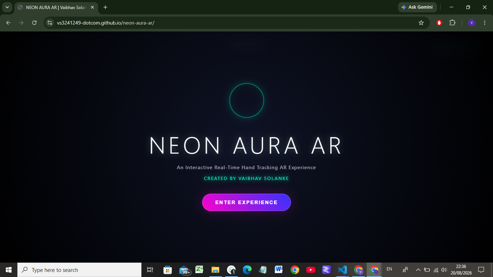
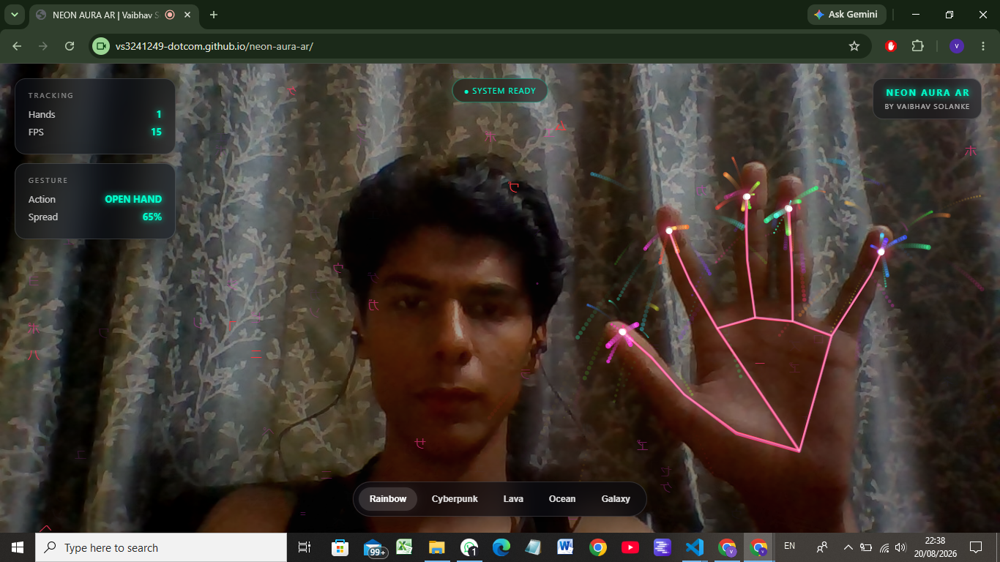
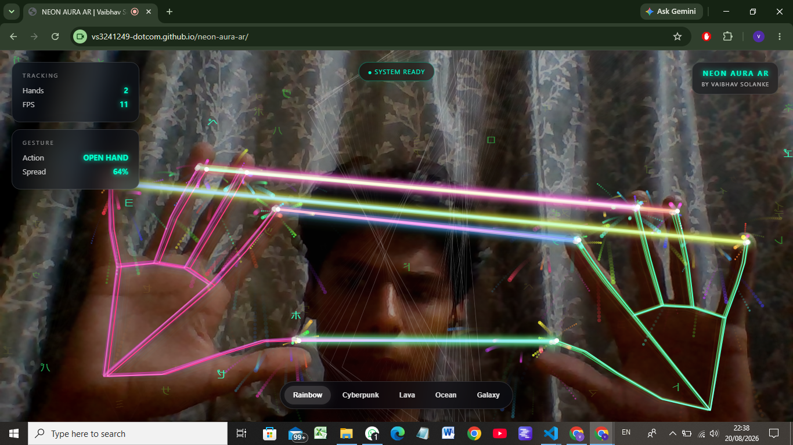

# 🌌 NEON AURA AR

### Real-Time Hand Tracking AR Experience

NEON AURA AR is an interactive browser-based AR experience that uses real-time hand tracking to create neon visual effects.

## 🚀 Live Demo

https://vs3241249-dotcom.github.io/neon-aura-ar/

## ✨ Features

- Real-time hand tracking
- Two-hand interaction
- Pinch gesture detection
- Neon hand skeleton
- Particle effects
- Lightning effects
- Shockwave effects
- Mandala-style visualization
- Interactive themes
- Audio feedback
- FPS and tracking HUD
- Responsive UI
- Loading and ready screen

## 🛠️ Technologies Used

- HTML5
- CSS3
- JavaScript
- Canvas API
- MediaPipe Hands
- Web Audio API
- GitHub
- GitHub Pages

## 🧠 How It Works

The webcam captures the user's hand.

MediaPipe Hands detects hand landmarks in real time.

JavaScript receives those landmarks and calculates hand positions and gestures.

The Canvas API then uses those positions to generate interactive visual effects.

```text
Webcam
   ↓
MediaPipe Hands
   ↓
Hand Landmarks
   ↓
JavaScript Gesture Detection
   ↓
Canvas Rendering
   ↓
Neon AR Effects
```

## 📸 Screenshots

### Start Screen



### Real-Time Hand Tracking



### Two-Hand Interaction



## 🎨 Visual Themes

- 🌈 Rainbow
- 🟣 Cyberpunk
- 🔥 Lava
- 🌊 Ocean
- 🌌 Galaxy

## ✋ Gesture Interaction

The project uses hand landmark positions to detect user interactions.

For example:

```text
Thumb + Index Finger
        ↓
Distance Calculation
        ↓
Pinch Detected
        ↓
Shockwave + Sound Effect
```

## 📁 Project Structure

```text
neon-aura-ar/
│
├── index.html
├── README.md
│
└── screenshots/
    ├── start.png
    ├── hand-tracking.png
    └── two-hand.png
```

## 💻 Run Locally

1. Download or clone the repository.
2. Open the project in VS Code.
3. Open `index.html`.
4. Run the project using a local server or open it in a supported browser.
5. Allow camera permission.
6. Click `ENTER EXPERIENCE`.
7. Show your hand to the camera.

## 🌐 Deployment

The project is deployed using GitHub Pages.

### Repository

https://github.com/vs3241249-dotcom/neon-aura-ar/

### Live Website

https://vs3241249-dotcom.github.io/neon-aura-ar/

## 👨‍💻 Creator

Created by **Vaibhav Solanke**

## 📌 Project Type

Browser-based Interactive AR / Computer Vision Project

---

⭐ If you like this project, consider giving the repository a star!
